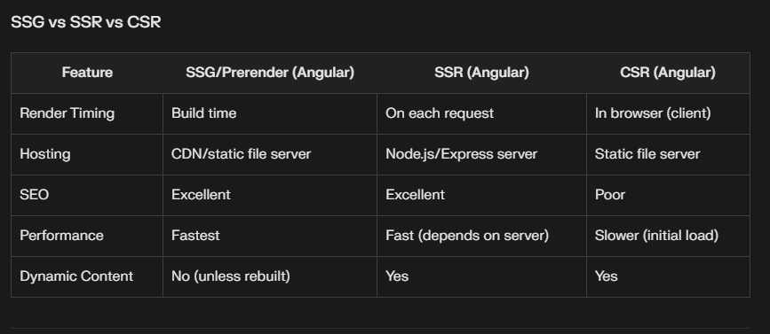
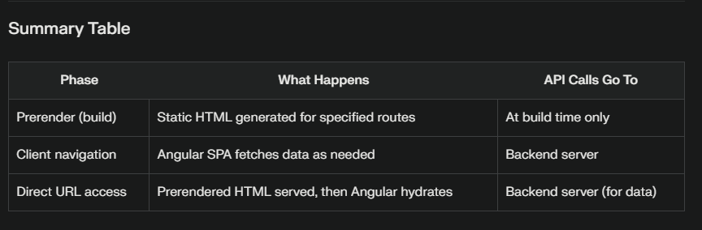

# AngularSsr

This project was generated using [Angular CLI](https://github.com/angular/angular-cli) version 19.2.14.

## Development server

To start a local development server, run:

```bash
ng serve
```

Once the server is running, open your browser and navigate to `http://localhost:4200/`. The application will automatically reload whenever you modify any of the source files.

## Code scaffolding

Angular CLI includes powerful code scaffolding tools. To generate a new component, run:

```bash
ng generate component component-name
```

For a complete list of available schematics (such as `components`, `directives`, or `pipes`), run:

```bash
ng generate --help
```

## Building

To build the project run:

```bash
ng build
```

This will compile your project and store the build artifacts in the `dist/` directory. By default, the production build optimizes your application for performance and speed.

## Running unit tests

To execute unit tests with the [Karma](https://karma-runner.github.io) test runner, use the following command:

```bash
ng test
```

## Running end-to-end tests

For end-to-end (e2e) testing, run:

```bash
ng e2e
```

Angular CLI does not come with an end-to-end testing framework by default. You can choose one that suits your needs.

## Additional Resources

For more information on using the Angular CLI, including detailed command references, visit the [Angular CLI Overview and Command Reference](https://angular.dev/tools/cli) page.


### 1. provideClientHydration(withEventReplay())??
provideClientHydration(withEventReplay()) is a configuration used in Angular applications that utilize server-side rendering (SSR) and hydration. Its primary purpose is to ensure that user interactions occurring before the hydration process completes are not lost, providing a seamless and interactive user experience

#### How It Works:
When your Angular app is SSR-enabled, the server sends pre-rendered HTML to the browser.
Users may interact with the page (clicks, typing, etc.) before Angular's client-side code is fully bootstrapped and hydrated.
Normally, these early interactions would be ignored because event listeners are not yet attached.
With Event Replay enabled: Angular captures and queues these native browser events (like click, mouseover, focusin) during the hydration window. Once hydration is complete and Angular takes over, it replays these events so the user’s actions are processed as if they happened after hydration

#### In short:
provideClientHydration(withEventReplay()) ensures that user actions made before hydration are not lost, making SSR Angular apps more interactive and user-friendly from the very first moment the page loads


### 2.afterNextRender vs afterRender in angular
#### afterRender
What it Does:
Registers a callback that executes after every render cycle (i.e., after each change detection and DOM update).

Use Cases:
Reacting to frequent DOM changes.
Adjusting element sizes or positions dynamically as content updates.
Synchronizing state with the DOM after every render.

Performance Note:
Since it runs after every render, use it judiciously to avoid performance issues

Analogy:
Like ngAfterViewChecked, but only in the browser and always after the DOM is painted.

#### afterNextRender
What it Does:
Registers a callback that executes only once, after the next render cycle (after the next change detection and DOM update).

Use Cases:
One-time DOM manipulations, such as initializing third-party libraries.
Setting up observers (e.g., ResizeObserver, IntersectionObserver) that require the DOM to be present.
Performing one-time setup after the initial render

Analogy:
Similar to ngAfterViewInit, but only runs in the browser and is safe with SSR.

#### Best Practices
afterNextRender:
Use for one-time DOM manipulations, such as initializing third-party libraries, setting up observers, or any setup that should only happen after the first render.

afterRender:
Use for repeated DOM updates that must occur after every change detection cycle, such as synchronizing chart data, updating styles, or handling animations.

Do not use these hooks in SSR or pre-rendering contexts:
They only run in the browser and have no effect during server-side rendering.

Avoid updating Angular state inside these hooks:
They are intended for DOM reads/writes, not for triggering further Angular state changes, to prevent errors like ExpressionChangedAfterItHasBeenCheckedError

### 3. SSG or prerender in angular
SSG/prerendering in Angular generates static HTML for routes at build time, offering top-tier performance, scalability, and SEO for pages that don’t require user-specific or frequently changing data. It’s ideal for static content, while SSR and CSR serve dynamic or interactive needs




### 4. Why Define Routes Both Client-Side and Server-Side?

Client-side routes (in app.routes.ts or similar) are used by Angular in the browser for navigation and rendering after the app has loaded.
Server-side routes (in app.routes.server.ts) are used by Angular Universal during prerendering and SSR to determine which routes to prerender (SSG), SSR, or handle as CSR.
Both must be kept in sync for consistent navigation and rendering across build-time (SSG), server requests (SSR), and client navigation

#### What Happens with Dynamic Routes and API Calls?
At build time (prerendering):
Angular generates static HTML for each specified route (e.g., /product/1, /product/2) using the server-side config and getPrerenderParams if needed.

At runtime (user interaction):

Client navigation (CSR):
After the app loads, navigating between routes (e.g., clicking links) happens in the browser. Angular fetches data via API calls as needed, and these calls go directly to your backend API.

Direct URL access or refresh:
If a user enters a URL or refreshes on a route, the server (or CDN) serves the prerendered HTML if available. If not, SSR (if configured) or fallback to CSR occurs. API calls made from Angular still hit your backend API.

#### Key Points
Prerendered pages are static:
They contain the HTML as generated at build time. Any dynamic data (e.g., product info) is fetched during the prerender build, not at runtime.

API calls after client interaction:
When a user interacts with the prerendered page (e.g., navigates, triggers data refresh), Angular runs in the browser and makes API calls to your backend server, just like in a normal SPA.

Direct URL requests:
If a prerendered HTML file exists for the route, it’s served instantly. If not, SSR can generate it on the fly (if configured), or the client-side app will bootstrap and fetch data as usual.

#### Example Scenario
1. Prerendering phase:
You configure /product/:id in both client and server route configs.
In getPrerenderParams, you specify {id: '1'} and {id: '2'}.
Angular generates /product/1 and /product/2 as static HTML.

2. User visits /product/1:
If served from a static host/CDN, the prerendered HTML is shown.
Angular bootstraps and hydrates the page; any further navigation or data fetches are handled via API calls to your backend.

3. User navigates to /product/2:
If prerendered, static HTML is shown; otherwise, SSR or CSR kicks in.
Angular fetches updated data as needed via API calls.

#### In short:
You must define routes on both the client and server for consistent prerendering and navigation. After prerendering, Angular behaves like a normal SPA: all API calls from client-side navigation or interaction go to your backend server, not to the static host or build server

